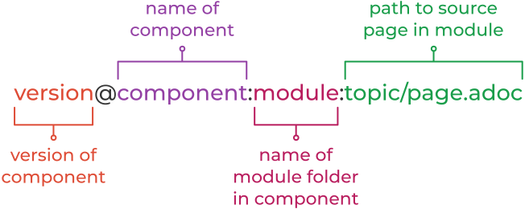

= Page to Page Xrefs

This document covers building references from one document to another in antora. These are best practices for the SUSE Manager/Uyuni Development Team.

It is important for you to understand what a component and a module are.

Version::
The version of the component in which the page lives; often mapped to a repository branch.

Component::
The documentation component to which the page belongs; often mapped to a repository.

Module::
The content bundle in which the page is grouped; if empty, defaults to ROOT.

Page::
The path to the page’s source file in the module, including any leading topic directories and the .adoc file extension.

These coordinates are organize in a standard structure to create a unique, fully-qualified page ID.

.*Components*
[IMPORTANT]
====
We only use one component(repository) currently. In general you need only concern yourself with <MODULE><TOPIC/page.adoc>.
====

== In the Same Component and Module

When the current page and the destination page are in the same module <BOOK> you should always add the book name to the xref.

.Link to a page in the same module
----
xref:reference:intro.adoc[Introduction]
----

.Link to a page in a topic folder
----
xref:reference:systems/all-systems.adoc[All Systems]
----

[IMPORTANT]
====
While you can use a shorthand reference when in the same module or <BOOK>:

----
xref:intro.adoc[Introduction]
----

This is not recommended as it makes our PDF references difficult to follow.

====

== In the Same Component but a Different Module

When the current page and the destination page are in the same component but different modules, you’ll enter the name of the destination module and destination file.

.Link to a Page in Another Module (From the Reference Module)
----
xref:installation:unified-installer.adoc[Unified Installer]
----

.Link to a Page in the ROOT Module and in a Topic Folder
----
xref:ROOT:home/about.adoc[About]
----

