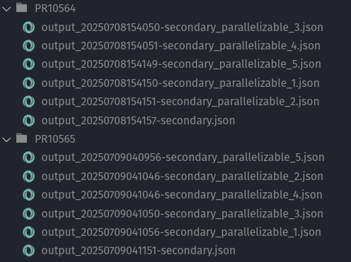
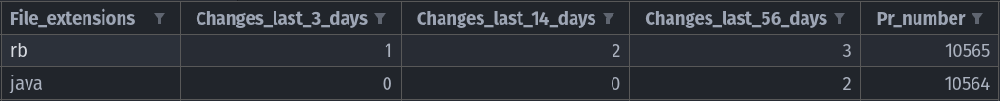
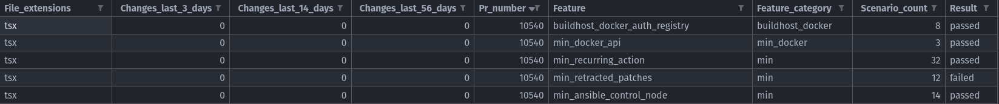
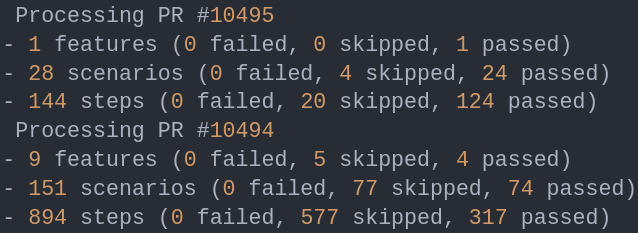

# Predictive Test Selection

This project is one of three that were accepted for Uyuni as part of Google Summer of Code 2025.

[Ahmed Khaled](https://github.com/Ahmed-Khaled-dev) is the contributor working on this project, with [Oscar Barrios](https://github.com/srbarrios) as the mentor.

You can find the [Google Summer of Code Proposal here](https://drive.google.com/file/d/1M9X60Arj5J-LVw0fQSaVWgtxCChwtq6T/view?usp=sharing), which contains extensive details about the project.

The project is composed of several interconnected parts. This README explains each component, how it functions, how they interact, and the reasoning behind key decisions.

> [!NOTE]
> Once the project is complete, I plan to include an architectural diagram illustrating the components and their interactions.

## 1. Pull Request Data Extraction Script

[pr_data_extraction.py](pr_data_extraction.py)

### Related GitHub Issues
- https://github.com/uyuni-project/uyuni/issues/10491
- https://github.com/uyuni-project/uyuni/issues/10553

### How to Use the Script

1. Set the `GITHUB_TOKEN` environment variable with a valid GitHub Access Token.
2. Optionally, adjust PR Data Extraction constants in [config.py](config.py)
3. The script supports two modes:
    1. **Training mode**: Collects data from the latest `N` PRs (with Cucumber reports). This includes downloading the Cucumber reports for secondary tests executed on each PR, enabling the preparation of training data that links PRs to their corresponding test results.
    2. **Prediction mode**: Gathers data from a single PR. In this mode, Cucumber reports are not collected, as they are not available in production scenarios where the goal is to predict which tests are most likely to fail for a new PR.

```
python pr_data_extraction.py <N>
python pr_data_extraction.py '#<PR_NUMBER>'

Where <N> is the number of the latest Uyuni PRs (with Cucumber reports) to extract data from,
or '#<PR_NUMBER>' is a specific PR number to extract features for.
```

### Example Script Output

#### Cucumber Reports


#### CSV File


### How the Script Works

**Prediction mode (single PR):**

1. Identifies the files modified in the PR.
2. Extracts the unique file extensions of the modified files.
3. Retrieves the change history for those files over several recent time windows.
4. Outputs a CSV file containing PR features: file extensions, change history, and PR number.

> [!IMPORTANT]
> In the CSV, PR number won't be used during training AI models, it only helps the upcoming Test Results Extraction Script identify the corresponding PR for each row.

> [!NOTE]
> Changelog files (`.changes`) are ignored when collecting modified files, as they are not relevant to the codebase.

**Training mode (multiple PRs):**

1. Retrieves the `N * PR_OVERSAMPLE_MULTIPLIER` most recently created PRs, oversampling to account for PRs that lack test runs or Cucumber reports.
2. For each of the `N` PRs:
    - Finds the **first completed** test run during the PR's lifetime that includes Cucumber reports (if none exist, the PR is skipped).
    - Downloads all Cucumber JSON reports from this initial test run.
    - Extracts and retains only secondary/recommended Cucumber test reports.
    - Identifies the files modified that triggered this test run.
    - Extracts the unique file extensions of the modified files.
    - Retrieves the change history for those files over several recent time windows.
    - Outputs a CSV file containing PR features: file extensions, change history, and PR number.
    - If the script encounters a configurable number of consecutive PRs without Cucumber reports, it will stop early and log a warning. This prevents unnecessary API calls when it is unlikely that more qualifying PRs exist among the candidates.

### Q&A

#### Why extract these specific PR features?

These features are inspired by the [Facebook paper](https://arxiv.org/pdf/1810.05286), where file extensions can indicate which types of changes are more likely to cause test failures (e.g., editing a `.java` vs. a `.xml` file), and file change history highlights active areas of development that are more prone to breakages.

While file extensions were useful at Facebook, they may be less informative for Uyuni, which is predominantly Java. Therefore, we plan to experiment with additional PR features as discussed in [#10553](https://github.com/uyuni-project/uyuni/issues/10553).

#### Why use the first test run with Cucumber reports, not the last?

My intuition is that we should focus on the first test run with Cucumber reports because it best reflects the real-world scenario we want to model: predicting test failures as soon as a new PR is opened, before any feedback or fixes have occurred. By using the initial test run, we capture the state of the code as it was originally submitted, ensuring our predictions are based on the same conditions developers face when their code is first tested. This approach avoids any bias introduced by subsequent test runs, which may include fixes or changes made in response to earlier failures.

#### Why only keep secondary/recommended Cucumber test reports?

Since the other tests are core tests, they are always executed at the start of every test run and cannot be skipped. They are mandatory for all PRs. Since these tests will always run regardless of our predictions, analyzing their results does not help us optimize test selection. Our focus is on secondary tests, which can be selectively executed.

#### Will the script get rate-limited by the GitHub API given a large N?

In practice, running the script with `N = 500` allowed us to collect data for about 150 PRs. We did not hit GitHub API rate limits, the script simply could not obtain more data because older PRs did not have stored Cucumber reports. The script continues processing until it gathers data for `N` PRs or exhausts all `N * PR_OVERSAMPLE_MULTIPLIER` candidates.

To further improve efficiency and minimize unnecessary API calls, the script will stop after encountering a set number of consecutive PRs without Cucumber reports. This helps avoid wasting time and API requests when it is unlikely that more qualifying PRs exist among the candidates.

Performance could also be improved by parallelizing 
requests or relying more on local Git operations instead 
of the GitHub API. While I wasn't able to accurately 
measure the time it took to collect data for the 150 PRs, 
it was less than two hours.

#### Why is `PR_OVERSAMPLE_MULTIPLIER` set to 4?

This value was chosen empirically to work well for small `N`. It can be later adjusted to optimize script performance and ensure `N` PRs with Cucumber reports are retrieved.

#### Why is `RECENT_DAYS = [3, 14, 56]`?

These time windows for file change history are based on the [Facebook paper](https://arxiv.org/pdf/1810.05286). We plan to experiment with different values to better suit Uyuni's codebase and improve prediction accuracy.

#### What about Cucumber GitHub Artifacts expiring after 90 days?

We are aware of this limitation and plan to implement a GitHub workflow to store Cucumber reports externally, ensuring long-term availability for training data.

## 2. Cucumber Results Extraction Script

[cucumber_results_extraction.py](cucumber_results_extraction.py)

### Related GitHub Issues
- https://github.com/uyuni-project/uyuni/issues/10498
- https://github.com/uyuni-project/uyuni/issues/10508
- https://github.com/uyuni-project/uyuni/issues/10510

### How to Use the Script

Run the PR data extraction script first, this script depends on its output and should not be used
independently.

```
python cucumber_results_extraction.py
```

### Example Script Output

#### CSV File



#### Cucumber Statistics



### How the Script Works

Extracts tests/features' results from the Cucumber JSON reports for each PR listed in the CSV file
produced by the PR data extraction script, and outputs a new CSV file with the
feature name, feature category, scenario counts, and pass/fail result added per feature per PR (features that were skipped are ignored and not added in the training data since they are not useful).

The script also logs Cucumber statistics for verification and debugging purposes.

To determine the results of the features, we need to evaluate the outcomes of the scenarios within these features, as well as the steps/hooks within these scenarios.

It determines the results of the Cucumber scenarios by checking all steps and hooks (will group both under the name "entries") inside this scenario, and the scenario is marked as failed if any entry has failed, marked as skipped if any entry was skipped and none failed, otherwise marked as passed. The same approach is used to determine the results of the steps/hooks.

The different part is **how it determines the result of a feature**, a feature is similarly marked as failed, if any scenario has failed. But the different part is that I **mark it as passed, if any scenario has passed and none failed**, otherwise marked as skipped (when all scenarios are skipped). 

### Q&A

#### Why mark a feature as passed, although it had some scenarios that were skipped?

Initially, I thought I should mark a feature as passed only if all scenarios in it passed and none were skipped, but after examining some features in Uyuni's test suite I believe this is an inaccurate approach and the more accurate approach is to consider a feature as passed as long as at least one scenario passed and none failed (even if some scanrios were skipped) since in Uyuni some scenarios are always expected to be skipped due to them only running on SUSE manager or not on GH Actions, etc.

A direct example of this is `srv_users.feature`, in which always two scenarios are skipped since they have the `@susemanager` tag.

This can be shown in the below test statistic generated from a PR that had `srv_users` run on it as a recommended test. Here, the two scenarios were detected as skipped, but still, the feature was considered as passed.

