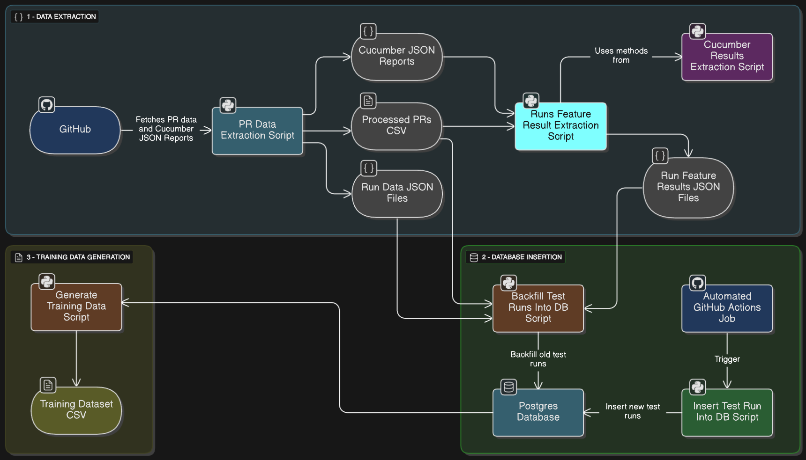

# Predictive Test Selection

This project is one of three that were accepted for Uyuni as part of Google Summer of Code 2025.

[Ahmed Khaled](https://github.com/Ahmed-Khaled-dev) is the contributor working on this project, with [Oscar Barrios](https://github.com/srbarrios) as the mentor.

You can find the [Google Summer of Code Proposal here](https://drive.google.com/file/d/1M9X60Arj5J-LVw0fQSaVWgtxCChwtq6T/view?usp=sharing), which contains extensive details about the project.

The project is composed of several interconnected parts. This README explains each component, its functionality, how to use it, its outputs, and the reasoning behind key decisions.

- [Phase 1 - Gathering Training Data](#phase-1---gathering-training-data)
  - [1. Storing Test Runs' Test Results](#1-storing-test-runs-test-results)
  - [2. Pull Request Data Extraction Script](#2-pull-request-data-extraction-script)
  - [3. Cucumber Results Extraction Script](#3-cucumber-results-extraction-script)
  - [4. Runs Feature Result Extraction Script](#4-runs-feature-result-extraction-script)
  - [5. Backfill Test Runs Into Database Script](#5-backfill-test-runs-into-database-script)
  - [6. Generate Training Data Script](#6-generate-training-data-script)

High-level diagram of this phase



- [Phase 2 - Training \& Testing](#phase-2---training--testing)
  - [1. Preprocessing Data](#1-preprocessing-data)

# Phase 1 - Gathering Training Data

## 1. Storing Test Runs' Test Results

We wanted to store the Cucumber test reports for each pull request test run to have a link between each test run and its corresponding test results.

The simplest and most straightforward approach was to use GitHub Artifacts, since these reports are generated within GitHub runners. On **23 June 2025**, we added the following code block to our GitHub Actions workflow to store the reports as artifacts. (The actual code contained additional Uyuni-specific details, which are omitted here for clarity, the core logic remains the same.)

```yaml
-  name: Upload Cucumber JSON Reports
    if: ${{ always() }}
    uses: actions/upload-artifact@v4
    with:
        name: cucumber_json_reports_${{ inputs.server_id }}
        path: ./testsuite/results/**/*.json
        # Duration after which the artifact will expire in days.
        # The maximum is 90 days.
        retention-days: 90
```

The issue with relying solely on GitHub Artifacts is that, as stated, they’re deleted after 3 months. This means we’d only have test results from runs within that time frame, losing anything older. For this project in particular, and generally, we wanted to preserve test results for a longer period.

We considered several ways to store Cucumber test (aka feature) results for each test run:

1. Store the full Cucumber JSON reports from GitHub Artifacts on an external server.
2. Store only the extracted feature results from the Cucumber reports in Redis, a document database, or a relational database.

The second approach offered a major advantage: storage efficiency. Full Cucumber JSON reports include step results, scenario details, screenshots, and other data we don’t need once feature results are extracted. Storing only the essentials would save considerable space.

We chose to use a relational database, specifically PostgreSQL, for three key reasons: 
1. We have a clear, stable schema in mind.
2. We want the ability to query, analyze, and visualize the data later.
3. Most importantly, this approach lets us store feature results **and** compute historical test failure rates, a key requirement for training, for any time range directly with SQL queries and joins, without needing a separate time-series database.

Below is the Postgres schema I designed:


[postgres_schema.sql](postgres_schema.sql)

**Notes**

1. The relationship between `test_runs` (which contains the `executed_at` field), `feature_results`, and `features` is what allows the calculation of historical test failure rates.
2. Modified files are stored in the database to ensure accurate tracking for each test run. Retrieving them from GitHub can be unreliable due to things like force-pushes, so keeping them in the database guarantees that all training data comes from a single source.
3. `scenario_count` in `features` represents the number of Cucumber scenarios (sub-tests) inside each Cucumber feature (test).
4. `run_number` in `test_runs` is a sequential counter for test runs within the same pull request (e.g., 1 for the first run, 2 for the second, and so on). When generating training data, we only use one test run per pull request, and `run_number` helps us flexibly select which one, for example, the first run, the first failed run, the last run, etc.
5. `feature_categories` are custom Uyuni test categories that can be found in [config.py](config.py) and are explained [here](https://github.com/uyuni-project/uyuni/blob/master/testsuite/documentation/guidelines.md#rules-for-features).

**Important**

When we began this project, we couldn’t immediately set up an automated process (via a GitHub Actions workflow) to insert each new test run, along with its modified files and feature results, into the database. First, we needed to confirm that:

- Given a test run, we could reliably extract the code training data we wanted (file extensions and the modification history of all modified files).
- Given the Cucumber reports, we could accurately extract the feature results, feature category name, and scenario count.

To validate this, we first implemented the functionality locally, gathering training data directly from GitHub’s test runs and Cucumber report artifacts (as implemented in `pr_data_extraction.py` and `cucumber_results_extraction.py`). Once we confirmed this worked locally, we aimed to do three things before deploying the database in production:

1. Backfill the database with historical data. By the time we started creating the database, about a month had passed, meaning test runs from that period weren’t yet stored in the database. Using `pr_data_extraction.py`, `cucumber_results_extraction.py`, and additional scripts, we retrieved all past test runs and their results from GitHub (before the 90-day artifact expiration) and inserted them into the database. This ensured we didn’t lose more than a month’s worth of valuable test run data.
2. Verify that we could insert test runs into the database and **generate a complete training data CSV from it**.
3. Create the GitHub Actions automation that continuously adds new test runs to the database.

Many of the following scripts were created for this backfill process, retrieving all historical test run data and feature results from before our automated insertion system existed. These same scripts functionalities will be reused by the GitHub Actions automation that will continuously add new test runs to the database.

> [!NOTE]
> Before running any of the below scripts, run `pip install -r requirements.txt`

## 2. Pull Request Data Extraction Script

[pr_data_extraction.py](pr_data_extraction.py)

### Functionality

From each test run in a set of recent pull requests, the script extracts:

1. Secondary Cucumber JSON reports.
2. Metadata for each run:
   - Run number
   - Run GitHub ID
   - Commit SHA that triggered the run
   - Result (passed/failed)
   - Execution timestamp
   - Modified files

Currently, this is the main useful functionality after setting up the database.

Additionally, the script can generate a complete code training dataset (as shown below in its output CSV). While this feature is not directly useful to us right now, certain helper functions, such as those for retrieving file extensions and file modification history, are reused in the separate script `generate_training_data.py`, which creates the training data CSV from the database.

### How to Use the Script

1. Set the `GITHUB_TOKEN` environment variable with a valid GitHub Access Token.
2. Optionally, adjust PR Data Extraction constants in [config.py](config.py)
3. The script supports three modes:
    1. Training mode (N): Collects data from the latest `N` PRs that had test runs. This includes downloading the Cucumber reports for secondary tests executed in each test run in each PR.
    2. Training mode (Date): Collects data from all PRs created since a specified date up to now. Like the N-based mode, this includes downloading Cucumber reports for training data preparation.
    3. Prediction mode: Gathers data from a single PR. In this mode, Cucumber reports are not collected, as they are not available in production scenarios where the goal is to predict which tests are most likely to fail for a new PR.
```
python pr_data_extraction.py <N> | <YYYY-MM-DD> | '#<PR_NUMBER>'
```

### Example Script Output In Training Mode

#### Test Runs' Cucumber Reports
Notice how for each PR, data is extracted for **each test run** that ran on this PR and produced Cucumber reports, `run_1` is the first test run that ran on the PR, `run_2` is the second, and so on.


#### Run data JSON file


#### CSV File


> [!IMPORTANT]
> - `Changes_last_X_days` indicate the number of changes/modifications that happened on the modified files over several recent days.
> - This CSV as a whole isn't the training data, as mentioned in [Storing Test Results](#1-storing-test-runs-test-results), all the training data will be obtained from the database, the current usage of this CSV is for the next scripts to know which PRs have had their test runs' data extracted so that they can process them and backfill them in the database.

### Q&A
<details>
<summary>Expand</summary>

#### Why extract these specific PR features?

These features are inspired by the [Facebook paper](https://arxiv.org/pdf/1810.05286), where file extensions can indicate which types of changes are more likely to cause test failures (e.g., editing a `.java` vs. a `.xml` file), and file change history highlights active areas of development that are more prone to breakages.

While file extensions were useful at Facebook, they may be less informative for Uyuni, which is predominantly Java. Therefore, we plan to experiment with additional PR features as discussed in [#10553](https://github.com/uyuni-project/uyuni/issues/10553).

#### Why only keep secondary/recommended Cucumber test reports?

Since the other tests are core tests, they are always executed at the start of every test run and cannot be skipped. They are mandatory for all PRs. Since these tests will always run regardless of our predictions, analyzing their results does not help us optimize test selection. Our focus is on secondary tests, which can be selectively executed.

#### Why is `PR_OVERSAMPLE_MULTIPLIER` set to 4?

This value was chosen empirically to work well for small `N`. It can be adjusted to optimize script performance and ensure `N` PRs with Cucumber reports are retrieved.

#### Why is `RECENT_DAYS = [3, 14, 56]`?

These time windows for modified file change history are based on the [Facebook paper](https://arxiv.org/pdf/1810.05286). We plan to experiment with different values to better suit Uyuni's codebase and improve prediction accuracy.
</details>

## 3. Cucumber Results Extraction Script

[cucumber_results_extraction.py](cucumber_results_extraction.py)

[Related GitHub Issue](https://github.com/uyuni-project/uyuni/issues/10498)

### Functionality

This script is not intended to run as a standalone tool after the database has been created. Instead, its main functionality is provided by the function `extract_results_and_scenario_counts`.

Given a folder containing Cucumber reports, this function:
- Accurately extracts the results of all features.
- Counts the number of scenarios for each feature.

The function is used in the `runs_feature_result_extraction` script.

### How the Script Works

<details>
<summary>Expand</summary>
<br>

To determine the results of the features, we need to evaluate the results of the scenarios within these features, as well as the steps/hooks within these scenarios.

We determine the results of the Cucumber scenarios by checking all steps and hooks (will group both under the name "entries") inside this scenario, and the scenario is marked as failed if any entry has failed, marked as skipped if any entry was skipped and none failed, otherwise marked as passed. The same approach is used to determine the results of the steps/hooks.

The different part is **how it determines the result of a feature**, a feature is similarly marked as failed, if any scenario has failed. But the different part is that I **mark it as passed, if any scenario has passed and none failed**, otherwise marked as skipped (when all scenarios are skipped). 

The script also logs Cucumber statistics for verification and debugging purposes.
</details>

### Q&A

<details>
<summary>Expand</summary>

#### Why mark a feature as passed, although it had some scenarios that were skipped?

Initially, I thought I should mark a feature as passed only if all scenarios in it passed and none were skipped, but after examining some features in Uyuni's test suite I believe this is an inaccurate approach and the more accurate approach is to consider a feature as passed as long as at least one scenario passed and none failed (even if some scanrios were skipped) since in Uyuni some scenarios are always expected to be skipped due to them only running on SUSE manager or not on GH Actions, etc.

A direct example of this is `srv_users.feature`, in which always two scenarios are skipped since they have the `@susemanager` tag.

This can be shown in the below test statistic generated from a PR that had `srv_users` run on it as a recommended test. Here, the two scenarios were detected as skipped, but still, the feature was considered as passed.


</details>

## 4. Runs Feature Result Extraction Script

[runs_feature_result_extraction.py](runs_feature_result_extraction.py)

### Functionality

Uses `extract_results_and_scenario_counts` and `get_feature_category` methods in the [Cucumber results extraction script](#3-cucumber-results-extraction-script) to extract features' names, categories, scenario counts, and results from the Cucumber reports inside each test run folder obtained by the [PR data extraction script](#2-pull-request-data-extraction-script) and saves the extracted data to a JSON file inside the corresponding test run folder to prepare backfilling test runs and their feature results in the database.

### Example JSON Output

A JSON file like the following will be generated inside each test run’s folder:

```json
[
  {
    "feature_name": "min_ansible_control_node",
    "category_name": "min",
    "scenario_count": 14,
    "result": "passed"
  },
  {
    "feature_name": "srv_logfile",
    "category_name": "srv",
    "scenario_count": 1,
    "result": "passed"
  },
  {
    "feature_name": "min_salt_user_states",
    "category_name": "min_salt",
    "scenario_count": 4,
    "result": "passed"
  }
]
```

## 5. Backfill Test Runs Into Database Script

[backfill_test_runs_into_db.py](backfill_test_runs_into_db.py)

### Functionality

This script is responsible for backfilling test runs into the database.

- Reads the CSV file produced by the [PR data extraction script](#2-pull-request-data-extraction-script).
- For each pull request, iterates through its test run folders.
- Uses:
  - Run data JSON files created by the [PR data extraction script](#2-pull-request-data-extraction-script).
  - Run feature results JSON files created by the [Runs feature results extraction script](#4-runs-feature-result-extraction-script).
- Inserts all test runs into the database.

### How to Use the Script

1. Ensure all prerequisite scripts have been executed. (`pr_data_extraction.py`, `runs_feature_result_extraction.py`)
2. Set the `DATABASE_CONNECTION_STRING` environment variable.
3. Run the script.

### Example Output

The example below shows the contents of the `test_runs` table. Other tables are populated as well.


I tested the database using https://neon.com/

## 6. Generate Training Data Script

[generate_training_data.py](generate_training_data.py)

### Functionality

This script generates the full training dataset as a CSV file directly from the PostgreSQL database.

Each pull request is represented by **one test run**:
- If a failed test run exists, the PR is represented by its **first failed test run**.
- Otherwise, the PR is represented by its **first test run**.

### How to Use the Script

1. Set the `GITHUB_TOKEN` environment variable with a GitHub Access Token. (The script needs it to connect to GitHub API since it uses `get_files_change_history` method from `pr_data_extraction.py`)
2. Set the `DATABASE_CONNECTION_STRING` environment variable.
3. Run the script.

### Example Output


> [!IMPORTANT]
> - `Modifications_Xd` indicate the number of modifications that happened on the modified files over several recent days.
> - `Pr_number`, `Run_number`, and `Feature` won't be used during training AI models, they are only currently added for debugging purposes and human readability.
> - `Failures_Xd` indicate the number of failures for the feature over several recent days.

### Q&A

<details>
<summary>Expand</summary>

#### Why represent PRs by the first failed test run or the first test run?

My intuition is that we should focus on the first test run because it best reflects the real-world scenario we want to model: predicting test failures as soon as a new PR is opened, before any feedback or fixes have occurred. By using the initial test run, we capture the state of the code as it was originally submitted, ensuring our predictions are based on the same conditions developers face when their code is first tested. This approach avoids any bias introduced by subsequent test runs, which may include fixes or changes made in response to earlier failures.

Additionally, failed features/tests are underrepresented in our data. To try to improve this imbalance, we prefer the first failed run if it exists, even if it's not the first run, as this increases the number of samples where failures occur. An alternative approach could be to represent PRs only by their first failed run (and ignore PRs without test failures), though this would reduce the overall dataset size.

</details>

<br>

# Phase 2 - Training & Testing

## 1. Preprocessing Data

[preprocessing_pipeline.py](preprocessing_pipeline.py)

### Functionality

- Data quality checks and cleaning
- Time-ordered train/test split by PR number based on `TEST_SET_SIZE` in [config.py](config.py).
- Consistent preprocessing using sklearn Pipeline
- Saving pipeline for production use

### Preprocessing

#### Extensions (Multi-hot Encoding)

- Keeps top extensions covering X% frequency, e.g., 95% of the extensions that appear, this value can be tweaked in [config.py](config.py) by tweaking `EXTENSION_COVERAGE_THRESHOLD`.
- Groups remaining as `ext_other`.
- Creates binary features: `ext_java`, `ext_ts`, etc.
- This captures most of the information without exploding dimensionality, and allows handling future unseen extensions.

#### Modifications (Log1p Transform)

- Applied log transformation to reduce the impact of extreme outliers. This ensures that pull requests with an unusually high number of modifications are brought closer in scale to the rest, which I read helps improve model training performance.

#### Run Number (Keep As-Is)
- Added binary `is_first_run` (1 if run_number == 1)

#### Categorical (One-hot Encoding)
- One-hot encoded `feature` and `feature_category`.

#### Scenario Count (Log1p Transform)

#### Failures (Keep As-Is)

#### Target Variable
- `result` → `failed` (binary: 1 if failed, 0 if passed)

### Outputs

1. Preprocessed training data CSV
2. Preprocessed testing data CSV
3. Preprocessing pipeline to be used in production