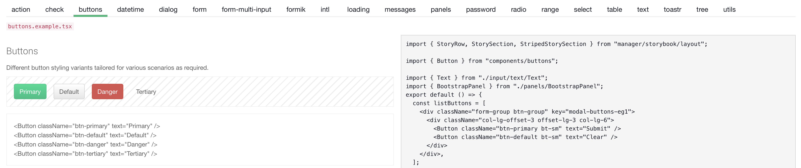

# `spacewalk-web`

The `web` subdirectory contains the modern web UI for Uyuni. It includes reusable components, stylesheets, assets such as fonts and images, translations, etc.  

This directory builds into the package `spacewalk-web`.  

## Prerequisites

Node and NPM have to be installed, please see [`engines` in `package.json`](https://github.com/search?q=repo%3Auyuni-project%2Fuyuni+path%3Apackage.json+%22engines%22&type=code) for the required version. Uyuni targets [the Active LTS version of Node](https://nodejs.dev/en/about/releases/).

```sh
zypper in nodejs22 npm22
cd uyuni
npm install
```

> [!NOTE]  
> If you need to use multiple versions of Node, you can use [nvm](https://github.com/nvm-sh/nvm).

## Frontend development proxy

The frontend development proxy will serve all local Javascript files with hot reload and proxy the rest of the application to a chosen backend server.

```sh
# Don't forget about the https://
npm run proxy https://server.tf.local
```

## Style guide of reusable components 

We use a style guide to document reusable components. The guide can be accessed at [https://server.tf.local/rhn/manager/storybook](https://server.tf.local/rhn/manager/storybook) (replace `server.tf.local` with your server FQDN).

The guide automatically loads all files matching `.example.ts` and `.example.tsx` on a full build. Reusable components live in `web/html/src/components`. Development of new reusable components should start with the guide first. You can use the development proxy described above for ease of development.  



## Scripts

The following scripts cover most day-to-day uses, see `package.json` for more:  

 - Run lint with autofixer: `npm run lint`
 - Run unit tests: `npm run test`  
 - Run the Typescript checker: `npm run tsc`  
 - Build the web UI: `npm run build`  
 - Run lint, tests, Typescript checker, and build the application: `npm run all`  
 - Audit production dependencies: `npm run audit-production-dependencies`
 - Run a development proxy against a server: `npm run proxy https://server.tf.local`  

## Directory structure

The `web` subdirectory consists of roughly the following main chunks:  

 - `web/po`: Translations.
 - `web/html/javascript`: Legacy scripts, most of them global. Over time we're slowly trying to sunset these piece by piece.  
 - `web/html/src/branding`: Branding assets, such as stylesheet sources, fonts, images etc.
 - `web/html/src/build`: Build tooling for the web UI.
 - `web/html/src/components`, `web/html/src/core`, `web/html/src/manager`, `web/html/src/utils`: Source code for the web UI.
 - `web/html/dist`: Output directory for the frontend build, do not check this directory in nor modify it directly, your changes will be overwritten by the next build.  

## Adding a new dependency

To add a new dependency:

```sh
npm --prefix web install <depency_name> # For run-time or build-time dependencies
npm --prefix web install --save-dev <depency_name> # For development-only dependencies
```

After adding or removing a dependency, run `npm run build` to update any relevant license files.

## Misc notes

### VSCode

If you use VSCode for development, please install [the ESLint extension](https://marketplace.visualstudio.com/items?itemName=dbaeumer.vscode-eslint).

### How to resolve `package-lock.json` conflicts

`package-lock.json` is a generated file, you generally don't want to resolve conflicts manually. First, try running `npm install` and see if NPM can resolve the conflicts automatically.  

If this doesn't resolve all of the conflicts, you can try the following:  

* solve conflicts with theirs
* run `npm install` again with the new dependencies you added

### Historical architecture notes

A blogpost about frontend work on Uyuni until October 2019: https://medium.com/better-programming/dont-be-afraid-of-legacy-how-to-gradually-introduce-react-js-in-a-really-old-application-79876c0dfa42?source=friends_link&sk=5499d4c809b8ccd6af121f61fd7bacd4
